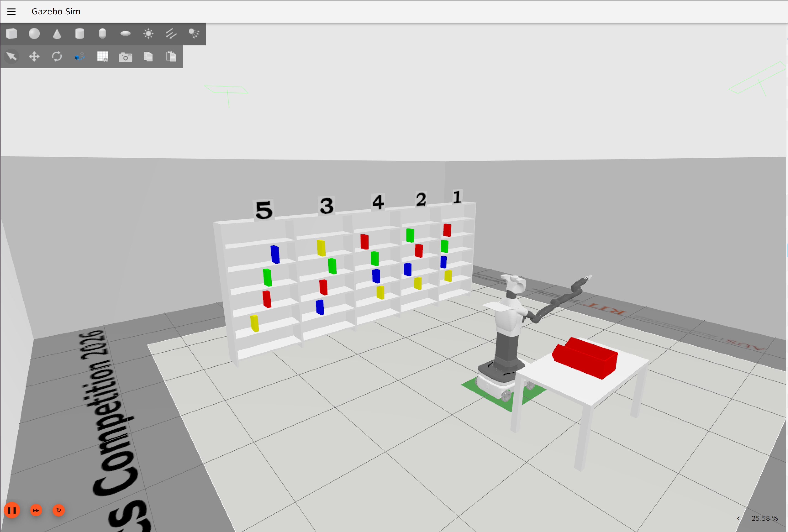
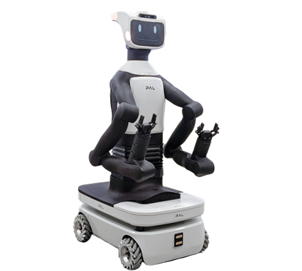
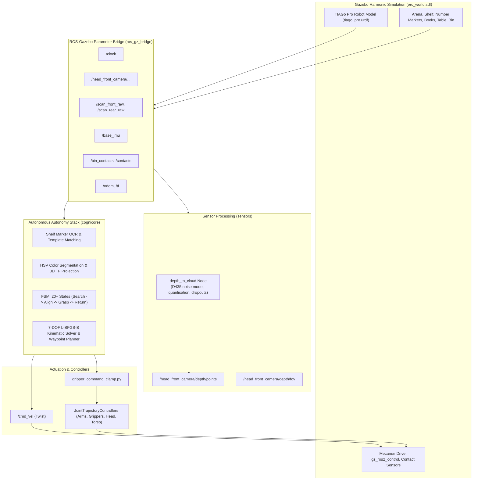

# Emirates Robotics Competition 2026 — Simulation & Autonomy Stack

**Library Assistant Robot Challenge**: Autonomous shelf recognition, multi-row book retrieval, and delivery using a **PAL Robotics TIAGo Pro** mobile manipulator in **Gazebo Harmonic** and **ROS 2 Humble**.

<p align="center">
  
  
</p>

---

## Table of Contents

- [Overview](#overview)
- [System Architecture](#system-architecture)
- [Repository Structure](#repository-structure)
- [Prerequisites](#prerequisites)
- [Quick Start Guide](#quick-start-guide)
  - [1. Host Setup & Docker Startup](#1-host-setup--docker-startup)
  - [2. Workspace Build](#2-workspace-build)
  - [3. Launching the Simulation](#3-launching-the-simulation)
  - [4. Opening Secondary Terminals](#4-opening-secondary-terminals)
- [Autonomous Controller (`cognicore`)](#autonomous-controller-cognicore)
  - [Running the Autonomous Mission](#running-the-autonomous-mission)
  - [Autonomous Pipeline & State Machine](#autonomous-pipeline--state-machine)
  - [Controller Configuration Parameters](#controller-configuration-parameters)
- [Sensor Stack & Realistic Noise Modeling (`sensors`)](#sensor-stack--realistic-noise-modeling-sensors)
- [Robot Platform & Kinematics](#robot-platform--kinematics)
  - [Hardware Specifications](#hardware-specifications)
  - [7-DOF Arm Kinematics & Optimization](#7-dof-arm-kinematics--optimization)
  - [Omnidirectional Mecanum Base](#omnidirectional-mecanum-base)
- [ROS 2 Interfaces Reference](#ros-2-interfaces-reference)
  - [Mobile Base Topics](#mobile-base-topics)
  - [Joint Trajectory Controllers](#joint-trajectory-controllers)
  - [Gripper Command Safety Clamp](#gripper-command-safety-clamp)
  - [Sensors & Feedback Topics](#sensors--feedback-topics)
- [Environment Randomization & Seeds](#environment-randomization--seeds)
- [URDF Generation & Model Patches](#urdf-generation--model-patches)
- [Troubleshooting & FAQs](#troubleshooting--faqs)
- [Issue Reporting](#issue-reporting)

---

## Overview

The **Emirates Robotics Competition 2026 (ERC 2026)** Library Assistant challenge requires an autonomous mobile manipulator to:
1. Start from an initial staging pose in an arena facing a 5-column bookshelf.
2. Locate the designated target column (1–5) by scanning and performing **OCR template matching** on overhead number markers.
3. Strafe and navigate using an omnidirectional Mecanum base to center in front of the target column at a precise manipulation depth.
4. Execute an elevation-aware visual search with the head RGB-D camera to detect a requested book color (**Red, Green, Yellow, Blue**) across various shelf tiers (Rows 1 to 5).
5. Solve inverse kinematics (IK) for the 7-DOF arm and adjust the prismatic torso lift height to reach into the narrow shelf slot.
6. Grasp the book spine, verify grip stability, retract the book smoothly without collision, and back away into the clear arena corridor.
7. Navigate to the drop table and place the retrieved book into the red collection bin, confirming delivery via contact sensors.

---

## System Architecture

The simulation and autonomy stack is divided into modular ROS 2 packages communicating over CycloneDDS:



---

## Repository Structure

```text
erc_sim_2026/
├── docker/                             # Docker containerization & launch scripts
│   ├── Dockerfile                      # ROS 2 Humble + Gazebo Harmonic + Nav2 + MoveIt
│   ├── docker-compose.yml              # Base container configuration
│   ├── docker-compose.gpu.yml          # NVIDIA GPU runtime passthrough overlay
│   ├── up.sh                           # Container startup helper (auto GPU detection)
│   ├── attach.sh                       # Open interactive shell in running container
│   ├── stop.sh                         # Stop simulation container
│   └── entrypoint.sh                   # Environment sourcing and ROS entrypoint
├── docs/                               # Documentation, schematics, and assets
│   ├── assets/                         # Visual assets and diagrams
│   └── tiago_pro_limits.pdf            # Physical joint limits reference
├── src/
│   ├── cognicore/                      # Autonomous controller & state machine
│   │   ├── cognicore/
│   │   │   └── controller.py           # Main autonomous navigation, OCR, IK & grasp node
│   │   ├── package.xml
│   │   └── setup.py
│   ├── erc_bringup/                    # Launch scripts, controllers & bridge configs
│   │   ├── config/                     # Controller parameters, camera bridge YAMLs
│   │   ├── launch/
│   │   │   ├── simulation.launch.py    # Main launch: Gazebo, bridges, robot, controllers
│   │   │   └── competition_run.launch.py # ERC competition execution wrapper
│   │   ├── rviz/competition.rviz       # Pre-configured RViz display
│   │   └── scripts/
│   │       ├── generate_urdf.py        # Compiles PAL xacros into patched tiago_pro.urdf
│   │       └── gripper_command_clamp.py# Soft-limit safety clamping for grippers
│   ├── erc_description/                # World models, SDFs, textures & patched URDF
│   │   ├── models/                     # 3D models: book, shelf, number_marker, table, bin
│   │   ├── urdf/tiago_pro.urdf         # Pre-generated competition robot URDF
│   │   └── worlds/erc_world.sdf        # Gazebo Harmonic competition arena world
│   ├── sensors/                        # Head RGB-D sensor post-processing
│   │   ├── launch/depth_to_cloud.launch.py
│   │   └── sensors/depth_to_cloud_node.py # RealSense D435 realistic noise simulation
│   └── [vendored PAL & ROS packages]/ # Upstream dependencies (omni_base, tiago_pro, gz_ros2_control)
└── README.md                           # This file
```

---

## Prerequisites

- **CPU**: `x86_64` (`amd64`) architecture. *(ARM-based hosts like Apple Silicon are not supported)*.
- **Operating System**: Linux host (Ubuntu 22.04 LTS or 24.04 LTS recommended) with X11 window server.
- **Docker**: Docker Engine 24.0+ and Docker Compose v2.
- **GPU (Recommended)**: NVIDIA GPU with `nvidia-container-toolkit` for hardware-accelerated Ogre2 rendering. *(Software rendering fallback is supported via integrated graphics, but simulation runs slower)*.
- **Storage**: Minimum 15 GB free disk space.
- **Network & DDS**: Default `ROS_DOMAIN_ID` is `23`. Ensure this ID does not conflict with other ROS 2 nodes on your local network.

---

## Quick Start Guide

All dependencies are vendored within this repository — no external package downloads or network access are required after cloning.

### 1. Host Setup & Docker Startup

Grant local Docker access to your X11 display and launch the container:

```bash
# Allow container to connect to X display
xhost +local:docker

# Build the image and start the container in background
./docker/up.sh --build
```

`up.sh` automatically detects if NVIDIA Container Toolkit is installed. If available, it applies `docker-compose.gpu.yml` for hardware acceleration.

### 2. Workspace Build

Attach to the running container and build the workspace:

```bash
# Attach to the simulation container
./docker/attach.sh

# Inside container:
colcon build --symlink-install
source install/setup.bash
```

> [!IMPORTANT]
> Always build with `--symlink-install`. Mixing symlink and non-symlink builds leaves stale artifacts. If build issues occur, run `rm -rf build/ install/ log/` and rebuild.

### 3. Launching the Simulation

Start the Gazebo Harmonic world, spawn the TIAGo Pro robot, load controllers, and initialize sensors:

```bash
# Inside container:
ros2 launch erc_bringup simulation.launch.py
```

To run Gazebo in headless mode (server only, saves GPU/CPU resources):

```bash
ros2 launch erc_bringup simulation.launch.py headless:=true
```

#### Spawn Timeline & Warmup
The simulation launch orchestrates startup timers to avoid discovery storms:
- **T + 0.0s**: Gazebo simulation, ROS bridge, robot state publisher.
- **T + 3.0s**: TIAGo Pro spawned at origin facing the arena (+90° yaw).
- **T + 5.0s**: Books and number markers spawned on the shelf.
- **T + 8.0s**: ROS 2 controllers spawned (`ros2_control`).
- **T + 9.0s**: Gripper safety clamp active.
- **T + 18.0s**: `sensors/depth_to_cloud` node initializes depth point cloud.

### 4. Opening Secondary Terminals

To interact with the running simulation or run nodes in parallel, open a new host terminal and run:

```bash
# Host terminal:
./docker/attach.sh

# Inside container:
source install/setup.bash
```

> [!CAUTION]
> Do **NOT** run `./docker/up.sh` again from another terminal, as it will recreate and kill your active simulation container. Use `./docker/attach.sh`.

---

## Autonomous Controller (`cognicore`)

The `cognicore` package contains an autonomous control pipeline designed to solve the full ERC 2026 challenge mission end-to-end.

### Running the Autonomous Mission

Attach to the running container in a secondary terminal and execute:

```bash
# Example: Retrieve RED book from Shelf Column 3
ros2 run cognicore controller --ros-args -p target_shelf:=3 -p target_color:=RED

# Example: Retrieve BLUE book from Shelf Column 1
ros2 run cognicore controller --ros-args -p target_shelf:=1 -p target_color:=BLUE

# Example: Retrieve any available book from Shelf Column 5
ros2 run cognicore controller --ros-args -p target_shelf:=5 -p target_color:=ANY
```

### Autonomous Pipeline & State Machine

The controller runs a 20 Hz deterministic state machine orchestrating navigation, perception, and manipulation:

```mermaid
stateDiagram-v2
    [*] --> WAIT_FOR_ODOM
    WAIT_FOR_ODOM --> TURN_RIGHT: Odometry received
    TURN_RIGHT --> IDENTIFY_SHELF: Rotated 90° toward shelf
    IDENTIFY_SHELF --> ALIGN_TO_SHELF: OCR confirms target marker X
    ALIGN_TO_SHELF --> DRIVE_TO_SHELF: Base laterally centered
    DRIVE_TO_SHELF --> SEARCH_FOR_BOOK: Reached approach distance
    SEARCH_FOR_BOOK --> MAP_BOOK: Color contour detected in RGB-D
    MAP_BOOK --> ALIGN_BASE_TO_BOOK: Stable 3D target locked in odom
    ALIGN_BASE_TO_BOOK --> LIFT_TORSO: Base positioned at 0.72m depth
    LIFT_TORSO --> PREPOSITION_ARM: Torso height matched to row
    PREPOSITION_ARM --> PLAN_GRASP: Arm at standoff corridor
    PLAN_GRASP --> APPROACH_BOOK: Cartesian IK waypoints planned
    APPROACH_BOOK --> CLOSE_GRIPPER: Gripper centered on book spine
    CLOSE_GRIPPER --> TEST_GRIP: Fingers clamped
    TEST_GRIP --> RETRACT_ARM: Grip confirmed
    RETRACT_ARM --> MOVE_BACK: Book pulled from slot
    MOVE_BACK --> LIFT_BOOK_CLEARANCE: Reached open corridor
    LIFT_BOOK_CLEARANCE --> RETURN_TURN_TO_TABLE: Arm tucked with payload
    RETURN_TURN_TO_TABLE --> RED_BOX_SEARCH: Rotated toward table
    RED_BOX_SEARCH --> PREPARE_DROP: Table collection bin locked
    PREPARE_DROP --> DROP_BOOK: Arm positioned over bin
    DROP_BOOK --> DROP_COMPLETE: Contact confirmed on /bin_contacts
    DROP_COMPLETE --> [*]
```



#### Detailed Stage Breakdown

1. **Heading & Alignment (`TURN_RIGHT`)**:
   - Turns 90° right relative to initial orientation to face the 5-column shelf directly.
2. **Shelf Identification (`IDENTIFY_SHELF`)**:
   - Heads-up camera view captures the overhead column markers.
   - Extracts the upper strip of the RGB frame, performs bilateral filtering and adaptive Otsu thresholding, then matches digit contours against ground-truth templates (digits 1 to 5).
3. **Lateral Base Servo (`ALIGN_TO_SHELF`)**:
   - Strafes holonomically using the Mecanum base to center directly in front of the identified target column.
4. **Approach Drive (`DRIVE_TO_SHELF`)**:
   - Drives forward while reading depth in real-time, halting when within the safe distance (`approach_distance = 1.85m`, minimum safe depth `0.58m`).
5. **Multi-Row Book Search (`SEARCH_FOR_BOOK`)**:
   - Sequentially sweeps head pitch across calibrated elevation presets: `LOW` (-0.82 rad), `TOP` (+0.27 rad), `UP` (+0.15 rad), `MID` (-0.10 rad), and `DOWN` (-0.40 rad).
   - HSV color segmentation extracts the target book mask; registered depth values project the centroid into 3D coordinates in `base_footprint` and `odom`.
6. **Temporal Filtering (`MAP_BOOK`)**:
   - Accumulates multiple inlier samples transformed into the stationary `odom` frame, rejecting sensor noise and shelf edge discontinuities.
7. **Fine Manipulation Base Servo (`ALIGN_BASE_TO_BOOK`)**:
   - Adjusts base lateral position and longitudinal distance to achieve the optimal manipulation standoff (`0.72m` depth from arm base).
8. **Torso Vertical Coordination (`LIFT_TORSO`)**:
   - Adjusts `torso_lift_joint` to bring the shoulder frame within optimal reach of the target shelf row.
9. **Cartesian Grasp Planning & Extraction (`PLAN_GRASP` → `RETRACT_ARM`)**:
   - Generates multi-step Cartesian insertion waypoints to prevent elbow/wrist collisions with shelf partitions.
   - Executes single-joint finger closing via `/gripper_left_controller_raw/joint_trajectory`.
   - Performs a test tug to verify positive purchase before linear extraction.
10. **Delivery & Confirmation (`RETURN_TURN_TO_TABLE` → `DROP_COMPLETE`)**:
    - Turns 180° back toward the arena table, locates the red collection container, positions the arm above it, opens the gripper, and registers delivery via `/bin_contacts`.

### Controller Configuration Parameters

| Parameter | Type | Default | Description |
|---|---|---|---|
| `target_shelf` | int | `3` | Target shelf column number (`1` to `5`). |
| `target_color` | string | `""` | Target book color (`"RED"`, `"GREEN"`, `"YELLOW"`, `"BLUE"`, `"ANY"`). Overrides ID if set. |
| `target_color_id` | int | `0` | Color ID index (`0: RED`, `1: YELLOW`, `2: GREEN`, `3: BLUE`, `4: ANY`). |
| `approach_distance`| double| `1.85` | Longitudinal travel distance (meters) from turn waypoint to shelf. |
| `show_camera_view` | bool | `true` | Enables OpenCV HUD rendering with state information and bounding boxes. |
| `head_scan` | bool | `true` | Enables automatic multi-row head elevation sweeping. |
| `lateral_sign` | double| `1.0` | Directional sign multiplier for Mecanum lateral strafe commands. |

---

## Sensor Stack & Realistic Noise Modeling (`sensors`)

The `sensors` package addresses simulation artifacts by replacing the empty default Gazebo RGB-D cloud with an **Intel RealSense D435 noise model**:

- **RealSense D435 Geometry**: Back-projects 32FC1 depth images through calibrated `camera_info` intrinsics ($640 \times 360$ px, $87^\circ \times 56^\circ$ FOV, $0.2 - 8.0$ m depth range).
- **Disparity-Domain Gaussian Noise**: Transforms depth to stereo disparity ($d = \frac{f \cdot B}{Z}$), injects Gaussian pixel noise, and back-projects to depth. Error naturally scales with distance quadratically ($\sim Z^2$).
- **Quantization Shells**: Snaps disparity to sub-pixel bit resolutions, reproducing realistic RealSense depth banding.
- **Edge Dropouts**: Prunes depth discontinuities and adds random dropouts along sharp object contours.
- **Colorization**: Publishes turbo distance colormap by default (matching RealSense Viewer) or aligned RGB fusion.

To run or customize the sensor node independently:

```bash
# Fused RGB-D color cloud
ros2 launch sensors depth_to_cloud.launch.py color_source:=rgb

# Clean cloud without RealSense noise simulation
ros2 launch sensors depth_to_cloud.launch.py realsense_noise:=false
```

---

## Robot Platform & Kinematics

### Hardware Specifications

The simulated robot is the **PAL Robotics TIAGo Pro**:

- **Base**: Omnidirectional Mecanum drive (4 independently driven roller wheels).
- **Manipulators**: Dual 7-DOF serial arms (left and right) with torque/position control.
- **End-Effectors**: PAL Pro parallel grippers with position feedback.
- **Torso**: Prismatic lift joint (`torso_lift_joint`, stroke $0.0$ to $0.35$ m).
- **Head**: 2-DOF pan-tilt mechanism (`head_1_joint` pan $\pm 1.30$ rad, `head_2_joint` tilt $-0.97$ to $+0.27$ rad).
- **Sensors**: Head-mounted Intel RealSense D435i RGB-D camera, front and rear $270^\circ$ SICK LiDARs, base 6-axis IMU.

### 7-DOF Arm Kinematics & Optimization

The left arm kinematics are modeled with the exact forward kinematic transformations from `torso_lift_link` to `gripper_left_grasping_link`:

$$\mathbf{T}_{\text{grasp}} = \left( \prod_{i=1}^{7} \mathbf{T}_{i}(\theta_i) \right) \mathbf{T}_{\text{tool}} \mathbf{T}_{\text{tip}}$$

Inverse Kinematics (IK) is solved via **L-BFGS-B** non-linear constrained optimization minimizing:

$$\min_{\mathbf{q}} \quad w_p \|\mathbf{p}(\mathbf{q}) - \mathbf{p}_{\text{target}}\|^2 + w_o \|\mathbf{R}(\mathbf{q}) - \mathbf{R}_{\text{target}}\|_F^2 + w_r \|\mathbf{q} - \mathbf{q}_{\text{seed}}\|^2$$

subject to soft joint limits:
- `arm_left_1_joint`: $[-0.450, 4.640]$ rad
- `arm_left_2_joint`: $[-2.370, 1.060]$ rad
- `arm_left_3_joint`: $[-2.540, 2.540]$ rad
- `arm_left_4_joint`: $[-2.370, 1.060]$ rad
- `arm_left_5_joint`: $[-3.590, 1.500]$ rad
- `arm_left_6_joint`: $[-1.810, 2.930]$ rad
- `arm_left_7_joint`: $[-2.370, 2.370]$ rad

### Omnidirectional Mecanum Base

The base uses the Gazebo `MecanumDrive` plugin with anisotropic friction modeling:
- Forward/backward translation: `linear.x`
- Lateral strafe (crab-walk): `linear.y`
- Heading rotation: `angular.z`

---

## ROS 2 Interfaces Reference

### Mobile Base Topics

| Topic | Type | Direction | Description |
|---|---|---|---|
| `/cmd_vel` | `geometry_msgs/msg/Twist` | Subscriber | Base command velocity (`linear.x`, `linear.y`, `angular.z`). |
| `/odom` | `nav_msgs/msg/Odometry` | Publisher | Wheel odometry. |
| `/tf` | `tf2_msgs/msg/TFMessage` | Publisher | Coordinate frame transformations (`odom` $\to$ `base_footprint`). |

#### Manual Control Examples:
```bash
# Drive forward
ros2 topic pub /cmd_vel geometry_msgs/msg/Twist "{linear: {x: 0.3, y: 0.0}, angular: {z: 0.0}}" --rate 10

# Strafe left (holonomic)
ros2 topic pub /cmd_vel geometry_msgs/msg/Twist "{linear: {x: 0.0, y: 0.3}, angular: {z: 0.0}}" --rate 10

# Rotate in place
ros2 topic pub /cmd_vel geometry_msgs/msg/Twist "{linear: {x: 0.0, y: 0.0}, angular: {z: 0.5}}" --rate 10
```

### Joint Trajectory Controllers

All joints are managed by `ros2_control` using `joint_trajectory_controller/JointTrajectoryController`.

| Controller | Command Topic | Controlled Joint(s) |
|---|---|---|
| `arm_left_controller` | `/arm_left_controller/joint_trajectory` | `arm_left_1_joint` .. `arm_left_7_joint` |
| `arm_right_controller` | `/arm_right_controller/joint_trajectory` | `arm_right_1_joint` .. `arm_right_7_joint` |
| `gripper_left_controller` | `/gripper_left_controller/joint_trajectory` | `gripper_left_finger_joint` (clamped) |
| `gripper_right_controller` | `/gripper_right_controller/joint_trajectory` | `gripper_right_finger_joint` (clamped) |
| `head_controller` | `/head_controller/joint_trajectory` | `head_1_joint`, `head_2_joint` |
| `torso_controller` | `/torso_controller/joint_trajectory` | `torso_lift_joint` |
| `joint_state_broadcaster` | `/joint_states` | All active robot joints |

#### Manual Joint Trajectory Examples:
```bash
# Move Left Arm to stow position:
ros2 topic pub --once /arm_left_controller/joint_trajectory trajectory_msgs/msg/JointTrajectory \
  "{joint_names: [arm_left_1_joint, arm_left_2_joint, arm_left_3_joint, arm_left_4_joint, \
  arm_left_5_joint, arm_left_6_joint, arm_left_7_joint], \
  points: [{positions: [0.26, -1.60, 0.35, -1.98, 0.0, -1.2, 0.0], time_from_start: {sec: 2}}]}"

# Open Left Gripper (0.04m):
ros2 topic pub --once /gripper_left_controller/joint_trajectory trajectory_msgs/msg/JointTrajectory \
  "{joint_names: [gripper_left_finger_joint], points: [{positions: [0.04], time_from_start: {sec: 1}}]}"

# Raise Torso Lift (0.30m):
ros2 topic pub --once /torso_controller/joint_trajectory trajectory_msgs/msg/JointTrajectory \
  "{joint_names: [torso_lift_joint], points: [{positions: [0.30], time_from_start: {sec: 2}}]}"
```

### Gripper Command Safety Clamp

To prevent hardware and physics destabilization, `erc_bringup/scripts/gripper_command_clamp.py` intercepts commands sent to `/gripper_left_controller/joint_trajectory`. Commands are validated against $[0.00, 0.069]$ m limits before being relayed to the underlying driver topic (`/gripper_left_controller_raw/joint_trajectory`).

### Sensors & Feedback Topics

| Topic | Type | Source / Spec |
|---|---|---|
| `/head_front_camera/head_front_camera/color/image_raw` | `sensor_msgs/msg/Image` | $640 \times 360$ px RGB @ 30 Hz |
| `/head_front_camera/head_front_camera/depth/image_rect_raw` | `sensor_msgs/msg/Image` | $640 \times 360$ px 32FC1 depth @ 30 Hz |
| `/head_front_camera/depth/points` | `sensor_msgs/msg/PointCloud2` | RealSense noise-modeled PointCloud |
| `/scan_front_raw` | `sensor_msgs/msg/LaserScan` | Front SICK TIM551 LiDAR ($270^\circ$, 25m) |
| `/scan_rear_raw` | `sensor_msgs/msg/LaserScan` | Rear SICK TIM551 LiDAR ($270^\circ$, 25m) |
| `/base_imu` | `sensor_msgs/msg/Imu` | 6-DOF Base IMU @ 100 Hz |
| `/contacts` | `ros_gz_interfaces/msg/Contacts` | Robot body collision contacts |
| `/bin_contacts` | `ros_gz_interfaces/msg/Contacts` | Collection bin delivery detection |

---

## Environment Randomization & Seeds

The competition arena layout is randomized on launch (book color ordering, column positions, number marker assignments, and row placement jitter).

To make the environment **100% reproducible** across runs for debugging:

```bash
# Set ERC_SEED environment variable before launching simulation
export ERC_SEED=42
ros2 launch erc_bringup simulation.launch.py
```

---

## URDF Generation & Model Patches

The robot's URDF is generated from PAL Robotics xacros and modified by `src/erc_bringup/scripts/generate_urdf.py` with custom Gazebo Harmonic patches:
1. **MecanumDrive Plugin**: Injects holonomic controller with tuned wheel separations and wheel radii.
2. **Surface Friction**: Injects anisotropic directional friction coefficients on the Mecanum rollers.
3. **Intel RealSense D435 Retargeting**: Overrides camera optical frame orientations and focal characteristics.
4. **Safety Controller Soft Limits**: Ensures arm joints adhere strictly to verified physical limits.

To regenerate the URDF after modifying xacros or patches:

```bash
python3 src/erc_bringup/scripts/generate_urdf.py
```

---

## Troubleshooting & FAQs

- **CycloneDDS Serialization Warnings (`serdata.cpp`)**:
  *Symptom*: Terminal prints warnings regarding non-null terminated strings during point cloud serialization.
  *Fix*: These are harmless DDS serialization notices and do not affect performance or functionality.
- **Robot or Controllers Fail to Spawn**:
  *Symptom*: `/cmd_vel` or arm trajectory topics have no subscribers.
  *Fix*: Wait at least 10 seconds after starting Gazebo. Robot spawner is on a 3-second timer and controller spawner is on an 8-second timer. Re-build `erc_bringup` if packages were modified:
  ```bash
  colcon build --symlink-install --packages-select erc_bringup
  source install/setup.bash
  ```
- **Base Not Strafing (No Lateral Movement)**:
  *Symptom*: Robot moves forward/back and turns, but `linear.y` commands do not move the robot sideways.
  *Fix*: Ensure the generated URDF contains the anisotropic friction patch (`src/erc_bringup/scripts/generate_urdf.py`).
- **RViz Point Cloud Appears Flat White**:
  *Symptom*: Point cloud displays with no depth or color distinction.
  *Fix*: In RViz, select the PointCloud2 display, change the **Color Transformer** from `FlatColor` to `RGB8` or `AxisColor`, and ensure `use_sim_time:=true`.
- **Display Connection Errors (`cannot open display :0`)**:
  *Symptom*: Docker container aborts with GUI/X11 authorization error.
  *Fix*: Run `xhost +local:docker` on the host machine before starting the container.

---

## Issue Reporting

If you encounter bugs, simulation glitches, or discrepancies in the models:

<p align="center">
  
</p>

1. Search existing repository issues to prevent duplicate reports.
2. Submit a new issue including:
   - Reproduction steps and CLI commands used.
   - Expected behavior vs. actual behavior.
   - Host environment details (Ubuntu version, GPU model, NVIDIA driver version).
   - Relevant terminal output or log snippets.
