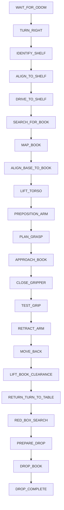

# Cognicore — Autonomous Controller Package

`cognicore` is the autonomous decision, perception, and manipulation package developed for the **Emirates Robotics Competition 2026 (ERC 2026)** Library Assistant robot challenge.

It runs a deterministic 20 Hz finite state machine controlling a **TIAGo Pro** mobile manipulator to autonomously locate, reach, grasp, extract, and deliver books from a 5-column bookshelf to a designated collection bin.

---

## Features

- **Overhead Shelf Marker OCR**:
  - Image preprocessing with bilateral filtering and adaptive Otsu thresholding.
  - Template matching against ground-truth numeral textures (digits 1 to 5) to identify the target column.
- **Holonomic Base Servoing**:
  - Closed-loop lateral strafing and longitudinal approach using the Mecanum base.
  - Safe distance regulation with front depth buffer monitoring (`approach_distance = 1.85m`, `min_safe_depth = 0.58m`).
- **Multi-Elevation Book Perception**:
  - Elevation-targeted head sweeps across calibrated rows (`LOW`, `TOP`, `UP`, `MID`, `DOWN`).
  - HSV color segmentation with contour moment calculation and registered depth sampling.
  - Temporal multi-frame filtering in the invariant `odom` frame to reject sensor noise and shelf edge discontinuities.
- **7-DOF Arm Kinematics & Optimization**:
  - Forward kinematics model from `torso_lift_link` to `gripper_left_grasping_link`.
  - Multi-seed **L-BFGS-B** non-linear optimization with soft joint limits.
  - Cartesian linear waypoints for collision-free entry into narrow shelf slots (0.35m height).
- **Active Torso Lift Coordination**:
  - Coordinated vertical motion of `torso_lift_joint` matching shelf row heights.
- **Verified Grasp & Safe Extraction**:
  - Deep spine insertion with finger pad clamping.
  - Physical tug test to verify grasp purchase.
  - Linear retraction and safe backward navigation into open arena corridors.
- **Return Navigation & Delivery**:
  - Heading reversal toward the collection table.
  - Visual localization of the red collection bin and delivery verification via `/bin_contacts`.

---

## Usage

Ensure the simulation workspace is built and sourced:

```bash
colcon build --packages-select cognicore --symlink-install
source install/setup.bash
```

Launch the autonomous controller with your desired target parameters:

```bash
# Retrieve RED book from Shelf 3
ros2 run cognicore controller --ros-args -p target_shelf:=3 -p target_color:=RED

# Retrieve BLUE book from Shelf 1
ros2 run cognicore controller --ros-args -p target_shelf:=1 -p target_color:=BLUE

# Retrieve any book from Shelf 4 without GUI rendering
ros2 run cognicore controller --ros-args -p target_shelf:=4 -p target_color:=ANY -p show_camera_view:=false
```

---

## Parameters

| Parameter | Type | Default | Description |
|---|---|---|---|
| `target_shelf` | int | `3` | Target column number (1 to 5). |
| `target_color` | string | `""` | Target book color name (`"RED"`, `"GREEN"`, `"YELLOW"`, `"BLUE"`, `"ANY"`). Overrides ID if specified. |
| `target_color_id` | int | `0` | Numeric color index (`0: RED`, `1: YELLOW`, `2: GREEN`, `3: BLUE`, `4: ANY`). |
| `approach_distance` | double | `1.85` | Distance (meters) to drive forward toward the shelf. |
| `show_camera_view` | bool | `true` | Show OpenCV debug window with HUD, detection overlays, and state diagnostics. |
| `head_scan` | bool | `true` | Enable head pitching across multiple shelf rows during visual search. |
| `lateral_sign` | double | `1.0` | Directional sign multiplier for Mecanum lateral strafe commands. |

---

## State Machine



---

## Topics

### Subscribed
- `/odom` (`nav_msgs/msg/Odometry`): Wheel odometry and heading.
- `/joint_states` (`sensor_msgs/msg/JointState`): Current positions of arm and gripper joints.
- `/head_front_camera/head_front_camera/color/image_raw` (`sensor_msgs/msg/Image`): Head RGB camera stream.
- `/head_front_camera/head_front_camera/depth/image_rect_raw` (`sensor_msgs/msg/Image`): Head 32FC1 depth stream.
- `/bin_contacts` (`ros_gz_interfaces/msg/Contacts`): Collision sensor inside the drop collection container.

### Published
- `/cmd_vel` (`geometry_msgs/msg/Twist`): Omnidirectional base velocity.
- `/head_controller/joint_trajectory` (`trajectory_msgs/msg/JointTrajectory`): 2-DOF head pitch and pan.
- `/torso_controller/joint_trajectory` (`trajectory_msgs/msg/JointTrajectory`): Prismatic torso elevation.
- `/arm_left_controller/joint_trajectory` (`trajectory_msgs/msg/JointTrajectory`): 7-DOF left arm trajectories.
- `/gripper_left_controller/joint_trajectory` & `/gripper_left_controller_raw/joint_trajectory` (`trajectory_msgs/msg/JointTrajectory`): Left gripper control.
